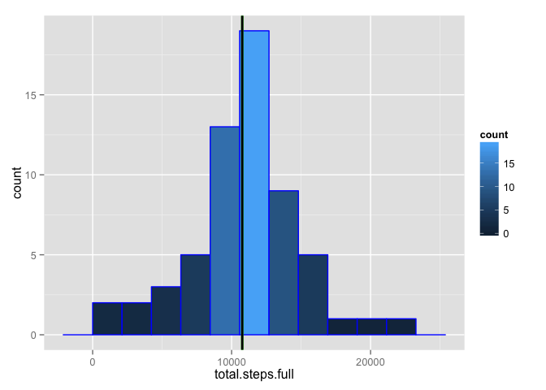

# Reproducible Research: Peer Assessment 1


## Loading and preprocessing the data

```r
library(ggplot2)

activity <- read.csv(unz("activity.zip", "activity.csv"))
activity <- transform(activity, date = as.Date(date, "%Y-%m-%d"))

# make a subset without NA values
activity.woNA <- activity[!is.na(activity$steps), ]

# reset row index to make it sequential again
rownames(activity.woNA) <- NULL
```

## What is mean total number of steps taken per day?

```r
# calculate total steps per date. tapply returns 1-dim array with date as 
# dimnames, we need to make a dataframe as it is a better format for plotting
total.steps <- as.vector(tapply(activity.woNA$steps, activity.woNA$date, sum))
total.steps.df <- data.frame(total.steps)
mean.ts <- mean(total.steps)
median.ts <- median(total.steps)

# calculate the range to set the binwidth of histogram 
ts.range = max(total.steps) - min(total.steps)

# median will be shown as a vertical green line on the histogram
ggplot(data = total.steps.df, aes(total.steps)) + 
    geom_histogram(binwidth = ts.range/10, col = "blue", aes(fill=..count..)) + 
    geom_vline(aes(xintercept = median.ts), color = "green", size = 1)
```

 

Mean of the total steps: 1.0766189\times 10^{4}  
Median of the total steps: 10765    

## What is the average daily activity pattern?

```r
# calculate average steps per interval. tapply returns 1-dim array with interval
# as dimnames, we need to make a dataframe as it is a better format for plotting
avg.steps <- tapply(activity.woNA$steps, activity.woNA$interval, mean)
avg.steps.df <- data.frame(interval = as.numeric(names(avg.steps)), 
                           average.steps = as.vector(avg.steps))

# This is needed to anser the question: Which 5-minute interval, on average 
# across all the days in the dataset, contains the maximum number of steps?
max.avg.steps.index <- which.max(avg.steps.df$average.steps)
max.avg.steps.interval <- avg.steps.df[max.avg.steps.index, "interval"]
max.avg.steps.value <- avg.steps.df[max.avg.steps.index, "average.steps"]

# A time series plot of the 5-minute interval (x-axis) and the average number 
# of steps taken, averaged across all days (y-axis). 
# Maximum is shown as a red dot.
ggplot(data = avg.steps.df, aes(interval, average.steps, group = 1)) +
    geom_line(aes(color = average.steps)) + 
    geom_point(data = NULL, 
               aes(max.avg.steps.interval, max.avg.steps.value), 
               color = "red", 
               size = 2)
```

 

Interval with the maximum number of steps on average across all days: 835  
The value in that interval: 206.1698113  

## Imputing missing values

```r
# How many NA values are there?
total.NA = sum(is.na(activity$steps))
```

Total number of rows with NA values: 2304


```r
# Make a subset with NA values in order to create the same dataset with 
# corresponding mean values per inteval 
activity.NA <- activity[is.na(activity$steps), ]

# Mean values per intervals have been calculated previously and are stored in 
# avg.steps.df, it will be used for merging by interval
activity.imp <- activity.imp <- merge(activity.NA, 
                                      avg.steps.df, 
                                      by = "interval")

# Make new dataframe with mean values instead of NA values. 
# This dataframe will be added to activity.woNA and the result will be a 
# complete dataset with imputed values.
# Keep in mind that the order of dates and intervals is broken after 
# manipulations, it will be corrected later.
activity.imp <- data.frame(steps = activity.imp$average.steps, 
                           date = activity.imp$date, 
                           interval = activity.imp$interval)

# Create a new dataset that is equal to the original dataset but with the 
# missing data filled in. 
activity.new <- rbind(activity.woNA, activity.imp)

# Reorder all the rows by date and interval in order to fix the original order
activity.new <- activity.new[order(activity.new$date, activity.new$interval), ]

# reindex rows as a sequence since reordering of the rows messed it up
rownames(activity.new) <- NULL

# calculate total steps per date for the full dataset with imputed values. 
total.steps.full <- as.vector(tapply(activity.new$steps, activity.new$date, sum))
total.steps.full.df <- data.frame(total.steps.full)
mean.ts.full <- mean(total.steps.full)
median.ts.full <- median(total.steps.full)

# Make a histogram of the total number of steps taken each day and Calculate 
# and report the mean and median total number of steps taken per day. Do these 
# values differ from the estimates from the first part of the assignment? 
# What is the impact of imputing missing data on the estimates of the total daily 
# number of steps?
ggplot(data = total.steps.full.df, aes(total.steps.full)) + 
    geom_histogram(binwidth = ts.range/10, col = "blue", aes(fill=..count..)) + 
    # median will be shown as a vertical green line on the histogram.
    geom_vline(aes(xintercept = median.ts.full), color = "green", size = 1) +
    # show old value of median with black vertical line
    geom_vline(aes(xintercept = median.ts), color = "black", size = 1)
```

 

Mean of the total steps on a dataset with imputed values: 1.0766189\times 10^{4}  
Median of the total steps on a dataset with imputed values: 1.0766189\times 10^{4}    

These mean and median values for the dataset with imputed values are almost the same as for the dataset with NA values dropped but the histogram looks a bit different.

## Are there differences in activity patterns between weekdays and weekends?
