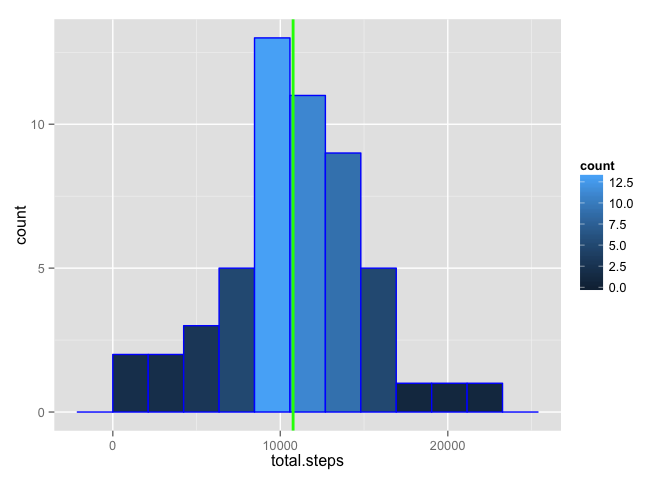
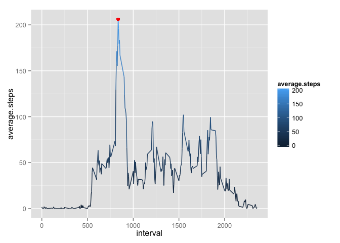

# Reproducible Research: Peer Assessment 1


## Loading and preprocessing the data

```r
library(ggplot2)

activity <- read.csv(unz("activity.zip", "activity.csv"))
activity <- transform(activity, date = as.Date(date, "%Y-%m-%d"))
activity.woNA <- activity[!is.na(activity$steps), ]
rownames(activity.woNA) <- NULL
```

## What is mean total number of steps taken per day?

```r
total.steps <- as.vector(tapply(activity.woNA$steps, activity.woNA$date, sum))
total.steps.df <- data.frame(total.steps)
mean.ts <- mean(total.steps)
median.ts <- median(total.steps)

ts.range = max(total.steps) - min(total.steps)

ggplot(data = total.steps.df, aes(total.steps)) + 
    geom_histogram(binwidth = ts.range/10, col = "blue", aes(fill=..count..)) + 
    geom_vline(aes(xintercept = median.ts), color = "green", size = 1)
```

 

Mean of the total steps: 1.0766189\times 10^{4}  
Median of the total steps: 10765    

## What is the average daily activity pattern?

```r
avg.steps <- tapply(activity.woNA$steps, activity.woNA$interval, mean)
avg.steps.df <- data.frame(interval = as.numeric(names(avg.steps)), 
                           average.steps = as.vector(avg.steps))
max.avg.steps.index <- which.max(avg.steps.df$average.steps)
max.avg.steps.interval <- avg.steps.df[max.avg.steps.index, "interval"]
max.avg.steps.value <- avg.steps.df[max.avg.steps.index, "average.steps"]

ggplot(data = avg.steps.df, aes(interval, average.steps, group = 1)) +
    geom_line(aes(color = average.steps)) + 
    geom_point(data = NULL, 
               aes(max.avg.steps.interval, max.avg.steps.value), 
               color = "red", 
               size = 2)
```

 

Interval with the maximum number of steps on average across all days: 835  
The value in that interval: 206.1698113  

## Imputing missing values

```r
total.NA = sum(is.na(activity$steps))
```

Total number of rows with NA values: 2304


```r
# Imputing missing values using mean for that 5-minute interval.
activity.NA <- activity[is.na(activity$steps), ]
activity.imp <- activity.imp <- merge(activity.NA, avg.steps.df, by = "interval")
activity.imp <- activity.imp[order(activity.imp$date), ]
rownames(activity.imp) <- NULL
activity.imp <- data.frame(steps = activity.imp$average.steps, 
                           date = activity.imp$date, 
                           interval = activity.imp$interval)
# Create a new dataset that is equal to the original dataset but with the missing data filled in
activity.new <- rbind(activity.woNA, activity.imp)
activity.new <- activity.new[order(activity.new$date, activity.new$interval), ]
rownames(activity.new) <- NULL
```

## Are there differences in activity patterns between weekdays and weekends?
